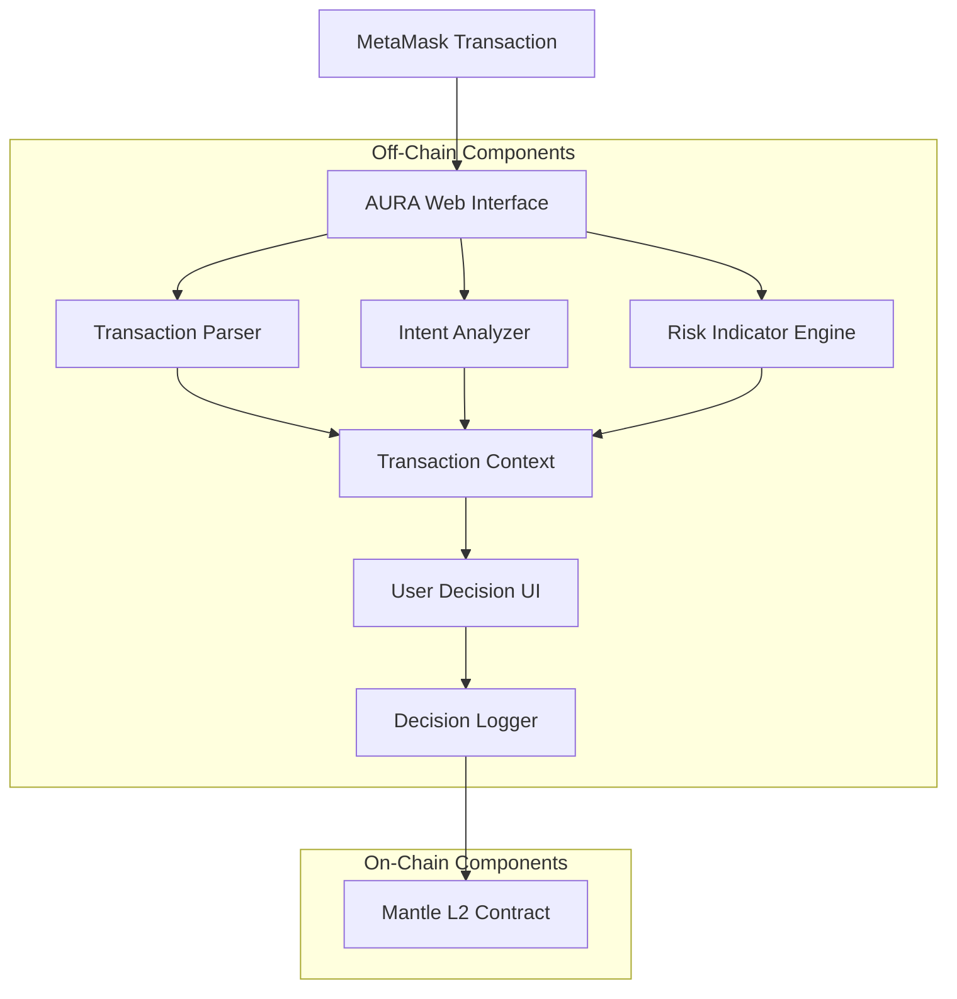

# AURA Design Document - AI Decision Firewall

## Overview

AURA is a hackathon MVP that demonstrates transaction transparency through AI-powered intent explanation and basic risk indicators. The system intercepts MetaMask transaction requests, explains what they do in plain English, shows simple warning flags, and logs user decisions to Mantle L2 for transparency.

**Core Insight**: Web3 users make transaction decisions with insufficient information. Current wallets show raw transaction data that requires deep technical knowledge to interpret. AURA bridges this gap by explaining transaction intent and providing basic risk context in human terms.

**Why This Problem Is Under-Addressed**: Existing solutions either focus on advanced security (requiring complex infrastructure) or basic transaction parsing (missing risk context). AURA occupies the sweet spot of educational transparency without overreaching security claims.

## Architecture

### System Components



### Component Responsibilities

**AURA Web Interface**
- Browser extension or web app that observes MetaMask transaction requests
- Displays transaction analysis and collects user decisions
- Handles MetaMask integration without deep wallet modification

**Transaction Parser**
- Decodes transaction data (recipient, value, function calls)
- Identifies contract interactions and token transfers
- Extracts key parameters for human-readable display

**Intent Analyzer**
- Rule-based system that categorizes transaction types
- Generates plain English explanations of transaction outcomes
- Maps common DeFi patterns to user-friendly descriptions

**Risk Indicator Engine**
- Checks basic risk signals: token age, contract verification, DEX pool presence
- Displays simple warning labels without security guarantees
- Uses cached/mocked data sources with transparent limitations

**Decision Logger**
- Records user approve/reject decisions to Mantle L2
- Implements privacy-preserving logging (hashed addresses)
- Provides simple aggregate statistics

**Mantle L2 Contract**
- Lightweight smart contract for immutable decision logging
- Optimized for low gas usage on Mantle L2
- Enables transparent decision pattern analysis

## Data Models

### Transaction Context
```typescript
interface TransactionContext {
  hash: string;
  type: TransactionType;
  recipient: string;
  value: string;
  intent: string;
  estimatedOutcome: string;
  riskIndicators: RiskIndicator[];
  timestamp: number;
}

enum TransactionType {
  TRANSFER = "transfer",
  SWAP = "swap", 
  APPROVAL = "approval",
  LIQUIDITY = "liquidity",
  UNKNOWN = "unknown"
}
```

### Risk Indicator
```typescript
interface RiskIndicator {
  type: IndicatorType;
  severity: "info" | "warning";
  message: string;
  source: string;
}

enum IndicatorType {
  NEW_TOKEN = "new_token",
  UNVERIFIED_CONTRACT = "unverified_contract", 
  NO_DEX_POOL = "no_dex_pool",
  HIGH_VALUE = "high_value"
}
```

### Decision Record
```typescript
interface DecisionRecord {
  transactionHash: string;
  userChoice: "approved" | "rejected";
  riskLevel: "low" | "medium" | "high";
  timestamp: number;
  addressHash: string; // Privacy-preserving hash
}
```

## Data & Decision Flow

### Step-by-Step Flow

1. **Transaction Initiation**
   - User initiates transaction in dApp
   - MetaMask prepares transaction request
   - AURA intercepts request before user confirmation

2. **Transaction Analysis**
   - Transaction Parser decodes raw transaction data
   - Intent Analyzer categorizes transaction type and generates explanation
   - Risk Indicator Engine checks basic risk signals
   - System assembles Transaction Context

3. **User Decision**
   - AURA displays transaction intent and risk indicators
   - User reviews information and makes approve/reject decision
   - If approved, user proceeds to MetaMask confirmation
   - If rejected, transaction is cancelled

4. **Decision Recording**
   - Decision Logger records user choice
   - Privacy-preserving hash generated for user address
   - Decision logged to Mantle L2 contract
   - Local cache updated for immediate UI feedback

5. **Transparency & Analytics**
   - Aggregate statistics calculated from Mantle L2 data
   - Simple counts displayed (approvals vs rejections)
   - No individual user data exposed

### Latency & Failure Points

**Potential Latency Sources**:
- Transaction parsing: <100ms (local processing)
- Risk indicator checks: <2s (cached data, simple API calls)
- Mantle L2 logging: <5s (non-blocking, background process)

**Failure Handling**:
- If risk data unavailable: Show "Unable to verify" warnings
- If Mantle L2 unavailable: Continue with local logging, sync later
- If analysis fails: Display raw transaction data with warning

## Realism Strategy

### Fully Real Components
- **Transaction Parser**: Complete implementation using ethers.js
- **Intent Analyzer**: Rule-based system for common DeFi patterns
- **AURA Web Interface**: Functional browser extension or web app
- **Mantle L2 Contract**: Deployed and functional smart contract
- **MetaMask Integration**: Working transaction interception

### Acceptable Mocking (Transparently Disclosed)
- **Token Age Data**: Use creation block from Etherscan API (free tier)
- **Contract Verification**: Etherscan verification status (free tier)
- **DEX Pool Presence**: Check major DEXs (Uniswap, SushiSwap) via subgraph
- **Risk Scoring**: Simple rule-based system, not ML-powered

### Transparent Limitations
- "Risk indicators are basic checks, not security guarantees"
- "Token data may be cached up to 1 hour"
- "Limited to major DEX pools for liquidity checks"
- "Intent analysis covers common patterns only"

## Judge Perspective

### Why Judges Will Remember This Project

1. **Solves Real Problem**: Transaction opacity is a genuine user pain point
2. **Honest Scope**: No overreaching security claims that invite skepticism
3. **Clear Demo**: Easy to show transaction interception and explanation working
4. **Meaningful Mantle Usage**: Demonstrates L2 benefits beyond "cheaper gas"
5. **Extensible Foundation**: Clear path to production features

### Differentiation from Typical AI + Web3 Submissions

**Avoids Common Mistakes**:
- No "AI will detect all exploits" claims
- No complex ML training requirements
- No enterprise-grade infrastructure assumptions
- No vague "AI analyzes blockchain" descriptions

**Demonstrates Understanding**:
- Realistic 6-day development timeline
- Appropriate use of existing tools (ethers.js, MetaMask APIs)
- Clear separation of on-chain vs off-chain logic
- Honest about limitations and mocking

### Technical Credibility Factors

1. **Specific Implementation Details**: Uses real libraries and APIs
2. **Realistic Architecture**: Components have clear, achievable responsibilities
3. **Proper Mantle Integration**: Shows understanding of L2 use cases
4. **Transparent Limitations**: Builds judge trust through honesty
5. **Demo-Ready Design**: Every component can be shown working

## Extension Vision (Post-Hackathon)

### Production Evolution Path

**Phase 1 (Post-Hackathon)**:
- Multi-wallet support (WalletConnect, Coinbase Wallet)
- Real-time oracle integration for accurate risk data
- Advanced intent analysis using LLMs
- Mobile app development

**Phase 2 (6-Month Horizon)**:
- Machine learning risk models trained on decision data
- Integration with security audit databases
- Advanced transaction simulation and MEV detection
- Enterprise dashboard for institutional users

**Phase 3 (Long-Term)**:
- Cross-chain transaction analysis
- Regulatory compliance features
- API for other wallet providers
- Decentralized governance for risk model updates

### Why Mantle Is The Correct Long-Term Home

1. **Cost Efficiency**: Decision logging requires frequent, low-value transactions
2. **Data Availability**: Mantle's DA layer perfect for transparent decision records
3. **Performance**: High throughput needed for mainstream adoption
4. **Developer Experience**: EVM compatibility enables rapid iteration
5. **Ecosystem Growth**: Early positioning in growing Mantle ecosystem
6. **Modular Architecture**: Aligns with Mantle's modular blockchain vision

**Strategic Advantages on Mantle**:
- Lower barrier to user adoption (cheaper logging costs)
- Better user experience (faster transaction confirmations)
- Stronger data guarantees (Mantle's security model)
- Ecosystem synergies (integration with other Mantle dApps)
- Future-proofing (Mantle's roadmap alignment)

## Correctness Properties

*A property is a characteristic or behavior that should hold true across all valid executions of a system—essentially, a formal statement about what the system should do. Properties serve as the bridge between human-readable specifications and machine-verifiable correctness guarantees.*

### Property 1: Transaction Analysis Completeness
*For any* valid Ethereum transaction, the AURA system should successfully parse and analyze it, producing a Transaction Context that includes transaction type, recipient, value, and human-readable intent explanation.
**Validates: Requirements 1.1, 1.2, 2.1, 2.3**

### Property 2: Intent Explanation Clarity
*For any* transaction analysis output, the intent explanation should use plain English without technical jargon and should not contain terms from a predefined technical vocabulary blacklist.
**Validates: Requirements 2.2**

### Property 3: Risk Indicator Completeness
*For any* token or contract being analyzed, the risk indicator system should provide both age/verification information and clear warning labels without making security guarantees or exploit detection claims.
**Validates: Requirements 3.1, 3.2, 3.3, 3.4**

### Property 4: User Choice Preservation
*For any* transaction presented to the user, the interface should always provide both approve and cancel options, and cancellation should prevent the MetaMask signing flow from proceeding.
**Validates: Requirements 1.3, 1.4**

### Property 5: Decision Logging Integrity
*For any* user decision (approve or reject), the system should create a complete log record on Mantle L2 containing transaction hash, user choice, timestamp, and privacy-preserving address hash, with no personal data included.
**Validates: Requirements 4.1, 4.2, 4.3**

### Property 6: Aggregate Statistics Privacy
*For any* query of decision logs, the system should return only aggregate counts (approvals vs rejections) without exposing individual user decisions or personal data.
**Validates: Requirements 4.4, 5.3**

### Property 7: Fallback Resilience
*For any* system component failure (L2 unavailability, data source timeout, analysis error), the system should continue functioning with appropriate fallback behavior and clear user communication about limitations.
**Validates: Requirements 5.4**

### Property 8: Gas Efficiency
*For any* decision logging operation on Mantle L2, the gas usage should remain within predefined efficient bounds appropriate for frequent logging operations.
**Validates: Requirements 5.2**

## Error Handling

### Transaction Analysis Errors
- **Unparseable transactions**: Display raw data with "Unknown transaction type" message
- **Network timeouts**: Show cached data with staleness warnings
- **Invalid transaction data**: Provide basic parsing with limited analysis

### Risk Indicator Failures
- **API unavailability**: Display "Unable to verify" warnings
- **Rate limiting**: Use cached data with age indicators
- **Invalid responses**: Show "Verification status unknown" messages

### Mantle L2 Integration Errors
- **Network unavailability**: Queue decisions for later logging, continue with local storage
- **Transaction failures**: Retry with exponential backoff, maintain local backup
- **Contract interaction errors**: Log errors locally, provide user notification

### User Interface Errors
- **MetaMask disconnection**: Graceful degradation with reconnection prompts
- **Browser compatibility**: Feature detection with fallback interfaces
- **Extension conflicts**: Clear error messages with troubleshooting guidance

## Testing Strategy

### Dual Testing Approach

AURA will use both unit testing and property-based testing to ensure comprehensive coverage:

**Unit Tests**: Verify specific examples, edge cases, and error conditions
- Test specific transaction types (ERC-20 transfers, Uniswap swaps, approvals)
- Validate error handling for malformed data
- Check integration points between components
- Verify MetaMask API interactions

**Property Tests**: Verify universal properties across all inputs
- Test transaction analysis completeness across random transaction data
- Validate intent explanation quality across diverse transaction types
- Verify privacy preservation across all logging operations
- Check system resilience across various failure scenarios

### Property-Based Testing Configuration

**Testing Framework**: fast-check (JavaScript/TypeScript property testing library)
**Test Configuration**: Minimum 100 iterations per property test
**Test Tagging**: Each property test references its design document property

**Tag Format**: `Feature: ai-decision-firewall, Property {number}: {property_text}`

### Test Implementation Requirements

Each correctness property will be implemented as a single property-based test:

1. **Property 1 Test**: Generate random valid transactions, verify complete analysis output
2. **Property 2 Test**: Generate random analysis outputs, verify plain English compliance
3. **Property 3 Test**: Generate random tokens/contracts, verify risk indicator completeness
4. **Property 4 Test**: Generate random transaction contexts, verify user choice availability
5. **Property 5 Test**: Generate random user decisions, verify complete logging integrity
6. **Property 6 Test**: Generate random log queries, verify aggregate-only responses
7. **Property 7 Test**: Generate random failure scenarios, verify graceful fallback behavior
8. **Property 8 Test**: Generate random logging operations, verify gas efficiency bounds

### Integration Testing

**MetaMask Integration**: Test transaction interception and user flow
**Mantle L2 Integration**: Test smart contract deployment and logging functionality
**End-to-End Flows**: Test complete user journeys from transaction initiation to decision logging

### Performance Testing

**Response Time Validation**: Ensure analysis completes within 5-second user expectation
**Gas Usage Monitoring**: Verify Mantle L2 operations remain cost-effective
**Concurrent User Simulation**: Test system behavior under multiple simultaneous users